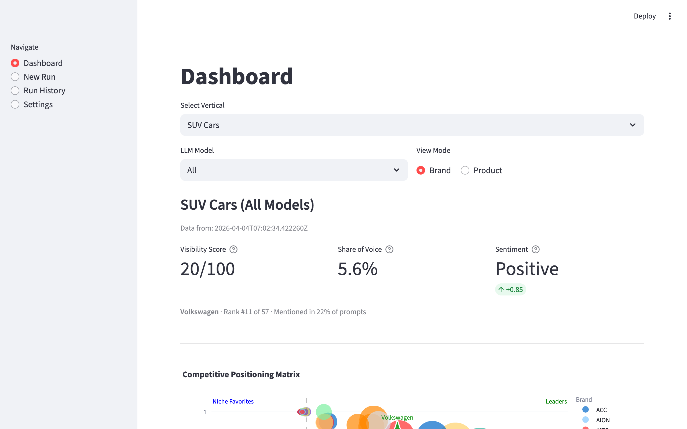
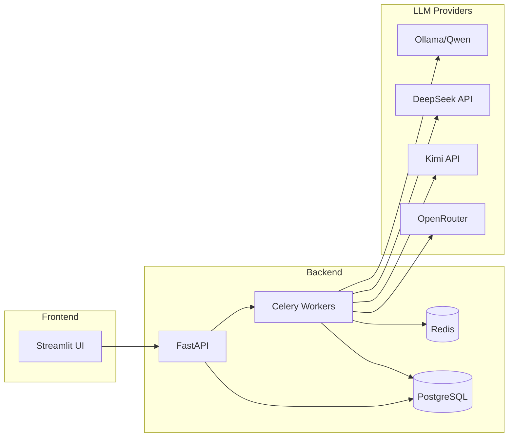

# DragonLens


**Brand visibility intelligence for Chinese LLMs**

> **Sabbatical Project** — This is an active work-in-progress (v0.1) being built during my travels.
> The backend architecture, LLM integrations, and metrics pipeline are fully functional.
> Brand and Product extraction still need fine-tuning and UI is still in progress.



## The Problem

Western brands have zero visibility into how Chinese AI assistants discuss their products. Almost all LLM tracking tools exclusively focus on western LLMs like ChatGPT, Gemini, PerplexityAI etc, but those tools are blocked in China and thus not used by its nearly 900 million consumers.
DragonLens fills this gap. It's a visibility tool specifically build for the Chinese Market. It queries Chinese LLMs with natural prompts, extracts brand mentions and rankings, analyzes sentiment, and calculates visibility metrics.

## Key Features

- **Multi-LLM Tracking** — DeepSeek, Kimi, Qwen, Bytedance's seed-1.6, Baiu's ERNIE, MinMax2.1 and possibly more models via OpenRouter
- **Local-First** — Runs entirely on your machine with Qwen 2.5 7B via Ollama; no API keys required to get started
- **Automated NER Pipeline** — Extract brands and products from Chinese responses with multi-stage validation
- **Visibility Metrics** — Share of Voice, mention rates, ranking positions, sentiment analysis
- **Bilingual Processing** — Automatic EN/ZH translation for prompts and responses
- **Competitive Intelligence** — Side-by-side brand comparison with positioning matrix
- **Background Processing** — Celery-powered async execution with Redis queuing

## Tech Stack


| Layer | Technology |
|-------|------------|
| API | FastAPI with OpenAPI/Swagger docs |
| Task Queue | Celery + Redis |
| Database | PostgreSQL (SQLite for local dev) |
| ORM | SQLAlchemy + Alembic migrations |
| UI | Streamlit |
| Local LLMs | Ollama (Qwen 2.5) |
| Remote LLMs | DeepSeek, Kimi/Moonshot, OpenRouter |

## Architecture



## Metrics Methodology

DragonLens computes visibility metrics designed for LLM response analysis:

| Metric | Formula | Description |
|--------|---------|-------------|
| **Share of Voice** | DCG-weighted: `1/log2(rank+1)` | Position-weighted presence relative to competitors |
| **Mention Rate** | `mentions / prompts` | Percentage of prompts where brand appears |
| **Top-Spot Share** | `#rank1 / prompts` | How often the brand is recommended first |
| **Sentiment Index** | `positive / total` | Ratio of positive mentions |
| **Dragon Visibility Score** | `0.6×SoV + 0.2×TopSpot + 0.2×Sentiment` | Composite 0-100 score |

## Requirements

| Component | Minimum | Recommended |
|-----------|---------|-------------|
| RAM | 16 GB | 32 GB |
| Storage | 20 GB free | 50 GB free |
| OS | macOS 12+ / Linux | macOS (Apple Silicon) |
| Python | 3.11+ | 3.11+ |
| Docker | Required | Required |

The local Qwen 2.5 7B model requires ~8 GB RAM. Apple Silicon Macs with unified memory run inference efficiently.

## Quick Start

```bash
# One-command setup (installs Poetry, Ollama, Qwen model, dependencies)
make setup

# Start all services (PostgreSQL, Redis, Ollama, API, Celery, Streamlit)
make run
```

Access the application:
- **UI:** http://localhost:8501
- **API Docs:** http://localhost:8000/docs

For remote LLMs (DeepSeek, Kimi), add your API keys in the UI under "API Keys".

## Project Status

### Implemented
- [x] Multi-LLM support (Qwen, DeepSeek, Kimi, OpenRouter)
- [x] End-to-end tracking pipeline
- [x] Brand/product NER extraction
- [x] Sentiment analysis (Erlangshen + Qwen fallback)
- [x] Ranking detection and scoring
- [x] Visibility metrics calculation
- [x] PostgreSQL + SQLite support
- [x] Streamlit UI with 6 pages
- [x] API key management (encrypted storage)
- [x] Entity consolidation and feedback system
- [x] WikiData integration for validation

### v1 Roadmap
- [ ] Feedback and self-learning system for brand/product extraction
- [ ] Extraction of product characteristics
- [ ] Auto-generate prompts by vertical and persona(s)
- [ ] Web search integration for relevant Chinese consumer web

### Future (v2+)
- [ ] Scheduled tracking jobs (Celery Beat)
- [ ] Multi-tenant user accounts
- [ ] Cloud deployment configs (AWS/GCP)

## Project Structure

```
src/
├── api/           # FastAPI REST endpoints
├── models/        # SQLAlchemy ORM models
├── services/      # LLM clients, NER, translation
├── workers/       # Celery background tasks
├── ui/            # Streamlit pages
└── prompts/       # LLM prompt templates

tests/
├── unit/          # Unit tests (27)
├── integration/   # Integration tests (25)
└── smoke/         # End-to-end tests (3)
```

## Development

```bash
make test          # Run all tests
make test-coverage # Tests with coverage report
make status        # Check service status
make logs          # Tail all service logs
make stop          # Stop all services
```

Run `make help` for all available commands.

## License

[MIT](LICENSE)
