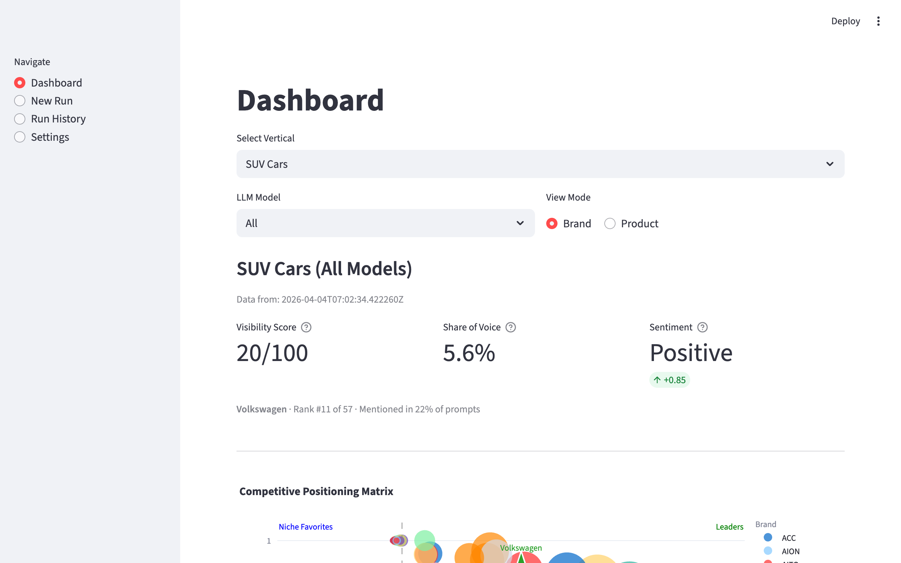
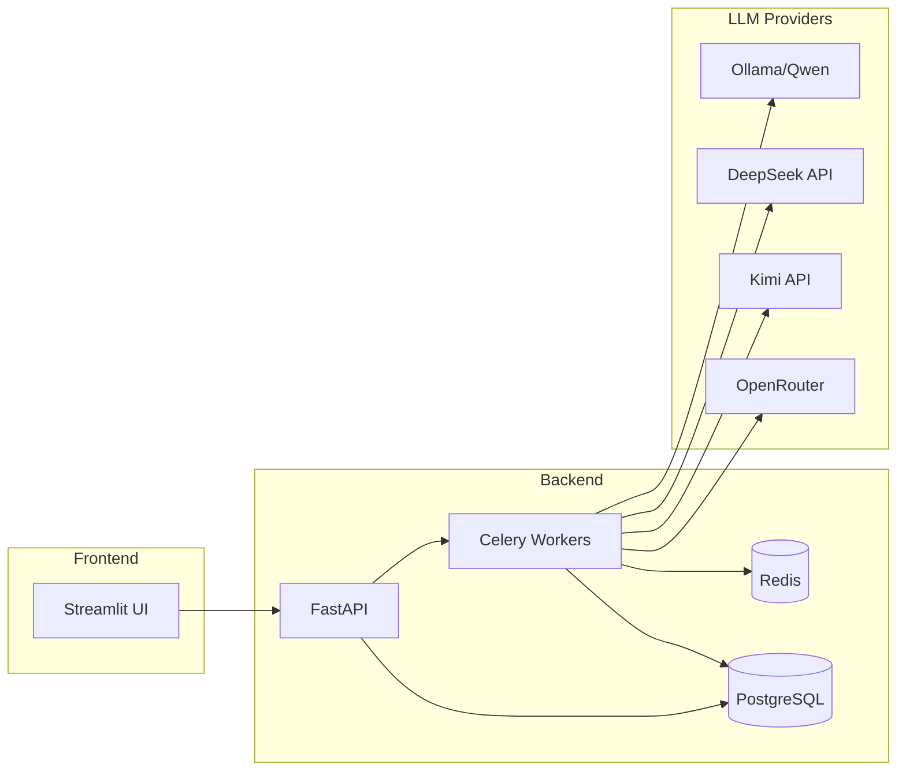

# DragonLens


**Brand visibility intelligence for Chinese LLMs**

> **Sabbatical Project** — This is an active work-in-progress (v0.1) being built during my travels.
> The backend architecture, LLM integrations, and metrics pipeline are fully functional.
> Brand and Product extraction still need fine-tuning and UI is still in progress.



## The Problem

Western brands have zero visibility into how Chinese AI assistants discuss their products. Almost all LLM tracking tools exclusively focus on western LLMs like ChatGPT, Gemini, PerplexityAI etc, but those tools are blocked in China and thus not used by its nearly 900 million consumers.
DragonLens fills this gap. It's a visibility tool specifically build for the Chinese Market. It queries Chinese LLMs with natural prompts, extracts brand mentions and rankings, analyzes sentiment, and calculates visibility metrics.

## Key Features

- **Multi-LLM Tracking** — DeepSeek and Kimi natively, plus 20+ Chinese models (Seed 2.0, ERNIE 4.5, Qwen 3.5, MiniMax M2.5, etc.) via OpenRouter
- **Local Qwen Support** — Qwen 2.5 7B via Ollama for extraction, translation, and low-cost local test runs
- **Automated NER Pipeline** — Extract brands and products from Chinese responses with multi-stage validation
- **Visibility Metrics** — Share of Voice, mention rates, ranking positions, sentiment analysis
- **Bilingual Processing** — Automatic EN/ZH translation for prompts and responses
- **Competitive Intelligence** — Side-by-side brand comparison with positioning matrix
- **Background Processing** — Celery-powered async execution with Redis queuing

## Tech Stack


| Layer | Technology |
|-------|------------|
| API | FastAPI with OpenAPI/Swagger docs |
| Task Queue | Celery + Redis |
| Database | PostgreSQL (SQLite in tests) |
| ORM | SQLAlchemy + Alembic migrations |
| UI | Streamlit |
| Local LLMs | Ollama (Qwen 2.5) |
| Remote LLMs | DeepSeek, Kimi/Moonshot, OpenRouter |

## Architecture


```mermaid
flowchart LR
    subgraph Frontend
        UI[Streamlit UI]
    end

    subgraph Backend
        API[FastAPI]
        Workers[Celery Workers]
        Queue[(Redis)]
        DB[(PostgreSQL)]
    end

    subgraph LLM Providers
        Qwen[Ollama/Qwen]
        DS[DeepSeek API]
        Kimi[Kimi API]
        OR[OpenRouter]
    end

    UI --> API
    API --> Workers
    Workers --> Queue
    Workers --> DB
    API --> DB
    Workers --> Qwen
    Workers --> DS
    Workers --> Kimi
    Workers --> OR
```

## Metrics Methodology

DragonLens computes visibility metrics designed for LLM response analysis:

| Metric | Formula | Description |
|--------|---------|-------------|
| **Share of Voice** | DCG-weighted: `1/log2(rank+1)` | Position-weighted presence relative to competitors |
| **Mention Rate** | `mentions / prompts` | Percentage of prompts where brand appears |
| **Top-Spot Share** | `#rank1 / prompts` | How often the brand is recommended first |
| **Sentiment Index** | `positive / total` | Ratio of positive mentions |
| **Dragon Visibility Score** | `0.6×SoV + 0.2×TopSpot + 0.2×Sentiment` | Composite 0-100 score |

## Extraction Pipeline

The pipeline extracts brands and products from Chinese LLM responses using a multi-step approach: knowledge base matching, local LLM extraction, and remote LLM consolidation.

### How It Works

| Stage | Process | Method |
|-------|---------|--------|
| **Translation** | Convert EN prompts to ZH, translate LLM answers back | Qwen 2.5 via Ollama |
| **Item Parsing** | Split response into discrete items (list items, table rows, paragraphs) | Heuristic parser |
| **KB Matching** | Match items against known brands/products from previous runs | Knowledge DB alias lookup |
| **Qwen Extraction** | Extract brand/product pairs from unmatched items | Qwen 7B zero-shot via Ollama |
| **Normalization** | Resolve aliases, parenthetical names (CJK/Latin), possessives | Deterministic + Knowledge DB |
| **Product Consolidation** | Strip brand prefixes, merge suffix variants (GTX/Mid/WP), group product lines | Deterministic + OpenRouter (Qwen 3.5 / ERNIE 4.5) |
| **Validation** | Filter common words, validate entity relevance to vertical | Pre-filter blocklist + OpenRouter LLM validation |
| **Knowledge Persistence** | Store validated brands, products, aliases, and brand-product mappings | Knowledge DB upsert |
| **Sentiment** | Classify each mention as positive/neutral/negative | Erlangshen-RoBERTa-110M (HuggingFace) |

### Extraction Metrics

Evaluated on gold-labeled data (Hiking Shoes + SUV Cars, 50 responses):

| Metric | Brands | Products |
|--------|--------|----------|
| **Precision** | 90.8% | 72.3% |
| **Recall** | 60.9% | 65.4% |

### Current Limitations

- **Brand recall** — LLM validation can be overly aggressive, dropping legitimate brands (~10pp variance between runs)
- **Product variants** — Suffix stripping (GTX, Waterproof, Mid) can over-consolidate distinct products
- **Snippet context** — Fixed 50-character window can truncate important context in long answers
- **Sentiment scope** — Analyzes isolated snippets, not full answer context
- **Cold start** — First run for a new vertical requires OpenRouter seeding call; subsequent runs benefit from Knowledge DB

## Requirements

| Component | Minimum | Recommended |
|-----------|---------|-------------|
| RAM | 16 GB | 32 GB |
| Storage | 20 GB free | 50 GB free |
| OS | macOS 12+ / Linux | macOS (Apple Silicon) |
| Python | 3.11+ | 3.11+ |
| Docker | Required | Required |

The local Qwen 2.5 7B model requires ~8 GB RAM. Apple Silicon Macs with unified memory run inference efficiently.

## Quick Start

```bash
# One-command setup (installs Poetry, Ollama, Qwen model, dependencies)
make setup

# Start all services (PostgreSQL, Redis, Ollama, API, Celery, Streamlit)
make run
```

Access the application:
- **UI:** http://localhost:8501
- **API Docs:** http://localhost:8000/docs

## LLM Configuration

Out of the box, DragonLens uses **Qwen 2.5 7B via Ollama** for extraction, translation, and local test runs—no API keys required. To use remote LLMs (DeepSeek, Kimi, or OpenRouter models), you need to add API keys.

> **Recommended:** An OpenRouter API key is strongly recommended. The extraction pipeline uses OpenRouter (Qwen 3.5 / ERNIE 4.5) for vertical seeding, entity normalization, product consolidation, and relevance validation. Without it, these steps fall back to local-only heuristics with lower extraction quality.

### Option 1: Via UI (Recommended)

1. Start the application with `make run`
2. Open the UI at http://localhost:8501
3. Navigate to **API Keys** in the sidebar
4. Select a provider and paste your API key
5. Keys are encrypted and stored in the database

### Option 2: Via Environment Variables

Add keys to your `.env` file in the project root:

```bash
# DeepSeek
DEEPSEEK_API_KEY=sk-your-deepseek-key

# Kimi (Moonshot)
KIMI_API_KEY=sk-your-kimi-key

# OpenRouter (access to 100+ models)
OPENROUTER_API_KEY=sk-or-v1-your-openrouter-key
```

Environment variables take precedence over UI-configured keys.

### Supported Providers

| Provider | Models | Get API Key |
|----------|--------|-------------|
| **Ollama** (local) | Qwen 2.5 7B | No key needed |
| **DeepSeek** | DeepSeek-V3, DeepSeek-R1 | [platform.deepseek.com](https://platform.deepseek.com) |
| **Kimi** | Kimi K2.5, Moonshot-v1 | [platform.moonshot.cn](https://platform.moonshot.cn) |
| **OpenRouter** | Claude, GPT-4, Llama, etc. | [openrouter.ai](https://openrouter.ai) |

## Project Status

### Implemented
- [x] Multi-LLM support (Qwen, DeepSeek, Kimi, OpenRouter)
- [x] End-to-end tracking pipeline
- [x] Brand/product NER extraction
- [x] Sentiment analysis (Erlangshen + Qwen fallback)
- [x] Ranking detection and scoring
- [x] Visibility metrics calculation
- [x] PostgreSQL + SQLite support
- [x] Streamlit UI with 4 pages
- [x] API key management (encrypted storage)
- [x] Entity consolidation and feedback system

### v1 Roadmap
- [ ] Feedback and self-learning system for brand/product extraction
- [ ] Extraction of product characteristics
- [ ] Auto-generate prompts by vertical and persona(s)
- [ ] Web search integration for relevant Chinese consumer web

### Future (v2+)
- [ ] Scheduled tracking jobs (Celery Beat)
- [ ] Multi-tenant user accounts
- [x] Dashboard demo deployment on Streamlit Community Cloud

## Project Structure

```
src/
├── api/           # FastAPI REST endpoints
├── constants/     # Enums and shared constants
├── data/          # Static data files
├── metrics/       # Visibility metrics calculation
├── models/        # SQLAlchemy ORM models
├── prompts/       # LLM prompt templates (Jinja2)
├── services/      # LLM clients, NER, translation
├── ui/            # Streamlit pages
└── workers/       # Celery background tasks

tests/
├── unit/          # Unit tests
├── integration/   # Integration tests
└── smoke/         # End-to-end tests
```

## Development

```bash
make test          # Run all tests
make test-coverage # Tests with coverage report
make status        # Check service status
make logs          # Tail all service logs
make stop          # Stop all services
```

Run `make help` for all available commands.
